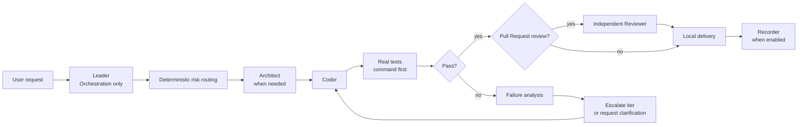

# Beggar Codex

[中文文档](README_CN.md)

Beggar Codex is a Codex-native multi-agent software engineering workflow. It routes work by risk, uses the least expensive model that is appropriate for the task, and escalates only when evidence shows that more reasoning or stronger verification is needed.

Beggar is designed as a platform-neutral core with optional delivery adapters. This public edition does not depend on Tencent-only services, Gongfeng, Knot, or internal MCP clients. GitHub is the default delivery target.

## Why Beggar exists

A single powerful agent may spend the same reasoning budget on a one-line configuration change and a production migration. A fixed multi-agent pipeline has the opposite problem: it runs every stage even when the task is trivial.

Beggar uses a risk-aware middle path:

1. Classify the task before spawning agents.
2. Use a low-cost model for clear, low-risk work.
3. Use a balanced model for normal cross-file development.
4. Use a high-assurance model for security, concurrency, irreversible changes, or repeated failure.
5. Run deterministic commands before asking another model to analyze a failure.
6. Review at the Pull Request boundary instead of forcing a full review loop on every small task.

## Architecture



The Leader coordinates the workflow, maintains state, dispatches child agents, and accepts or rejects results. It must not impersonate a Coder, Tester, Reviewer, or Director and must not modify business code itself.

## Three risk tiers

The runtime uses three abstract tiers. Model IDs are deployment-specific aliases and can be changed without changing the workflow policy.

| Tier | Example model alias | Typical task | Behavior |
|---|---|---|---|
| **L1 · Luna** | `gpt-5.6-luna` | One file, existing pattern, clear acceptance criteria | Skip unnecessary design work; run the shortest real verification command |
| **L2 · Terra** | `gpt-5.6-terra` | Normal feature, API change, cross-file refactor | Add architecture planning and stronger reasoning; escalate on evidence |
| **L3 · Sol** | `gpt-5.6-sol` | Security, concurrency, production incident, irreversible migration, review dispute | Use high reasoning, mandatory verification, and Director arbitration when required |

Routing is calculated from task signals rather than role names alone. Signals include risk tags, expected file count, ambiguity, novelty, test uncertainty, irreversibility, review disputes, and previous failure rounds.

```text
L1 failure or insufficient evidence       -> L2
L2 failure, hard risk, or review dispute  -> L3
Repeated failure or major disagreement    -> Director root-cause analysis
```

## Quality gates

- **Architect** turns the request into a proposal, design, task list, test plan, and explicit file scope.
- **Coder** modifies only assigned files, reads the relevant language rules, adds or updates tests, and performs a scope self-check.
- **Tester** runs the project’s real build and test commands and reports the exact command, exit code, and output evidence. It is enabled when risk, failure, or test complexity justifies it.
- **Reviewer** independently reads the implementation and checks specification compliance, security, error handling, performance, maintainability, test validity, and simplification.
- **Recorder** captures non-obvious decisions and reusable lessons after completion.
- **Director** handles repeated failures, design disputes, or capability/environment boundaries; it does not rewrite business code.

Progress is recorded in `start-state.json` and `agent_dispatch.log`, preventing a resumed task from silently repeating completed stages after context compression.

## Cost and efficiency model

Beggar controls cost through:

1. **Tiered model use**: expensive reasoning is reserved for high-risk or failed work.
2. **Conditional stages**: ordinary tasks use real commands first; Tester and full Reviewer stages are enabled when their evidence value is high.
3. **Small task boundaries**: independently verifiable tasks limit retry scope.
4. **Safe parallelism**: independent tasks may run in parallel; shared interfaces, migrations, review, and merge remain serial.
5. **State-based recovery**: completed stages are not paid for twice after context compression.

Beggar does not claim a universal saving percentage. Actual savings depend on model prices, task mix, context length, retry rate, and Pull Request review policy. Measure token usage and wall-clock time in your own environment.

## Included skills

| Skill | Purpose |
|---|---|
| `beggar-init` | Validate the Codex workflow, optional tools, child-agent capability, and GitHub CLI/integration |
| `beggar-brainstorming` | Clarify material ambiguity once before architecture work |
| `beggar-workflow` | Risk routing, state management, role contracts, quality gates, and escalation |
| `github-workflow` | Optional GitHub repository, Pull Request, Review, Checks, and merge adapter |

## GitHub integration

The core workflow does not assume a specific GitHub API implementation. The adapter prefers an authorized GitHub integration or MCP and falls back to the standard `gh` CLI.

```bash
gh auth login
gh auth status
gh pr list --state open
```

The adapter reuses an existing Pull Request for the same source branch, checks the real diff and CI status, posts structured review findings, and requires explicit user authorization before merging.

Platform authentication failures stop GitHub operations but do not invalidate local code reading, testing, or verification reports.

## Installation

### From a GitHub marketplace checkout

```bash
git clone https://github.com/<owner>/beggar-codex.git
cd beggar-codex
codex plugin marketplace add .
codex plugin add beggar-codex@beggar-codex
```

After installation, start a new Codex task and run `/beggar:init`.

## Optional dependencies

- `openspec`: used when available; otherwise the workflow creates Markdown artifacts with the same change structure.
- `codegraph`: recommended for multi-file call-chain and impact analysis; simple tasks can use normal file search.
- `gh` or a GitHub integration: required only for GitHub Pull Request operations.

The core routing and quality gates work without these optional dependencies.

## Scope and limitations

- Beggar is a workflow policy and reference implementation, not a guarantee that generated code is correct.
- Model IDs, pricing, availability, and reasoning limits vary by deployment and should be configured locally.
- Real tests remain mandatory evidence; model confidence is not a test result.
- The workflow intentionally avoids personas and custom agent display names because those are not portable across Codex runtimes.
- GitHub operations are isolated in `github-workflow`; the core does not contain provider-specific credentials or endpoints.

## Repository layout

```text
beggar-opensource/
├── .agents/plugins/marketplace.json
├── plugins/beggar-codex/
│   ├── .codex-plugin/plugin.json
│   └── skills/
├── CHANGELOG.md
├── README.md
└── README_CN.md
```

## License and contributions

This staging copy does not yet declare a public license. Add an approved license, contribution guide, security policy, and maintainer information before publishing to GitHub.
