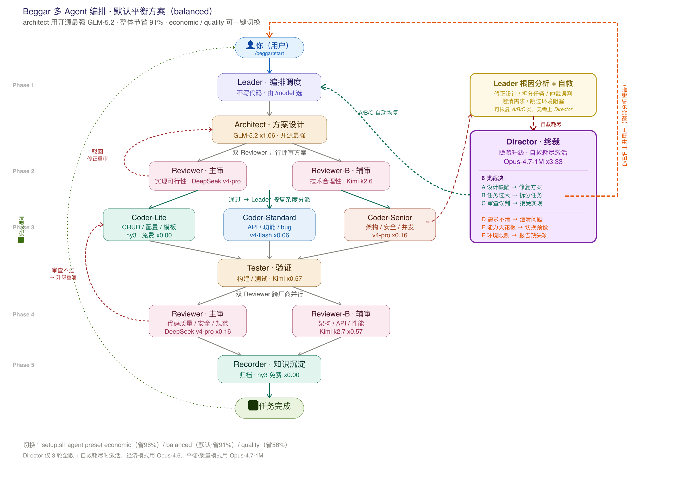

# Beggar — CodeBuddy 多 Agent 模型差异化省钱套件

[English](README.md) | **中文** | [模型选择依据](dist/MODEL_SELECTION.md) | [角色主题](dist/PERSONAS.md) | [更新日志](CHANGELOG.md)

可复用的多Agent研发配置，适用于 [CodeBuddy Code](https://cnb.cool/codebuddy/codebuddy-code)（CLI 与 IDE）。

> **兼容性**：同时兼容 CodeBuddy CLI 和 IDE。子 Agent 通过 `Agent` 工具调度，两种环境均可使用。模型差异化（`coder-lite` → hy3、`coder-standard` → V4-Flash 等）在 CLI 中通过 `model` 参数实现；IDE 使用主面板模型，以 Agent 指令差异化替代。

> **版本适配**：默认预设套餐最佳适配 **CodeBuddy 个人标准版**。其他版本（如企业版、旗舰版等）可用模型可能不同，需根据各版本实际支持的模型通过 `beggar agent custom` 自定义配置后方可使用。

>

## 前置依赖

| 依赖 | 是否必需 | 自动安装？ | 说明 |
|------|---------|-----------|------|
| [CodeBuddy Code](https://cnb.cool/codebuddy/codebuddy-code)（CLI 或 IDE） | ✅ 必需 | — | 宿主平台，建议 v2.90+ |
| Python 3 | ✅ 必需 | — | 用于 QuickStart 向导、Hook 和状态管理。需在 PATH 中可用（`python` 或 `python3`） |
| curl + tar | ✅ 必需 | — | 安装时下载和解压使用。大多数系统已预装 |
| [Superpowers](https://github.com/anthropics/superpowers) 插件 | ⭐ 推荐 | — | 质量实践（TDD、系统化调试）。`init` 时打印安装指令。未安装时工作流仍可运行 |
| [OpenSpec CLI](https://www.npmjs.com/package/@fission-ai/openspec) | 🔧 可选 | — | beggar 已内置 `openspec-*` skill，CLI 仅提供 `openspec list/archive` 等便利命令。如需安装：`npm install -g @fission-ai/openspec` |

> 💡 **提示**：安装后运行 `.codebuddy/setup.sh init`，会检查依赖并打印 Superpowers 安装指令。

## 快速开始

### 方式一：在线脚本安装（推荐，CLI 环境）

```bash
# 交互式选择安装模式（项目安装 / 全局安装）
curl -fsSL https://github.com/jagerzhang/beggar/raw/main/install.sh | bash

# 直接全局安装（安装到 ~/.codebuddy/，所有项目共享）
curl -fsSL https://github.com/jagerzhang/beggar/raw/main/install.sh | bash -s -- --global
```

> ⚠️ **Windows 用户**：不要在 PowerShell / cmd.exe 里直接跑上面的命令（PowerShell 的 `curl` 是 `Invoke-WebRequest` 别名，不认 `-fsSL`）。请使用 **Git Bash** 或 **WSL**，详见下方「[兼容性要求](#兼容性要求)」章节。

> **安装模式说明**：
> - **项目安装**（默认）：安装到当前项目 `.codebuddy/`，配置跟随项目
> - **全局安装**（`--global`）：安装到 `~/.codebuddy/`，所有项目自动继承
> - 项目级和全局级可共存：项目级 agents/rules/skills 优先，全局级作为兜底

### 方式二：Skill 安装（推荐，IDE 环境）

在 CodeBuddy 对话中直接输入：

> **通过 https://github.com/jagerzhang/beggar/releases/latest/download/beggar-skill.zip 安装 beggar**

AI 将自动下载、安装并引导你完成配置，自动检测 IDE/CLI 环境并适配模型配置。

### 安装后常用命令

```bash
# 更新到最新版本（重新运行安装脚本，自动增量同步）
curl -fsSL https://github.com/jagerzhang/beggar/raw/main/install.sh | bash

# 选择预设方案
.codebuddy/setup.sh agent preset balanced

# 查看当前配置
.codebuddy/setup.sh show
```

## 包含内容

| 组件 | 说明 |
|------|------|
| `agents/` | 9 个 Agent 定义文件（architect、coder-senior、coder-standard、coder-lite、reviewer、reviewer-b、tester、recorder、director） |
| `beggar-models.json` | 模型目录、预设方案、别名映射、任务分级规则、Review Gate 升级机制 |
| `setup.sh` | 一站式初始化与模型配置管理 |
| `rules/` | 代码规范 + RTK 令牌优化规则 + **Leader 禁写代码规则** |
| `skills/` | 研发工作流、OpenSpec 变更管理 |
| `commands/` | `/beggar:start`、`/beggar:status` 斜杠命令 |

## Agent 架构



> 图示为默认 **balanced** 预设的模型配置。`economic` / `quality` 预设的模型映射见下方「模型预设」章节。

**流程要点**：
- **Leader**（编排调度，不写代码）→ **Architect**（方案设计 + 闸门评审）
- Architect 按任务复杂度自动分派到 **Coder-Lite / Coder-Standard / Coder-Senior** 三级
- Coder 完成后 → **Tester**（构建+测试验证）→ **双 Reviewer 并行**（主审 DeepSeek + 辅审 Kimi，跨厂商交叉验证）
- 双 Reviewer 通过 → **Recorder**（知识沉淀）→ 任务完成
- **Review Gate 升级**（红色虚线）：审查不过 → 自动升级到更高级 Coder 重写
- **Director**（隐藏升级，3 轮全败时激活）：6 类裁决，A/B/C 自动恢复，D/E/F 上升用户

### 双 Reviewer 机制

coder 完成代码后，**同时进入两个 reviewer**，形成交叉验证：

| Reviewer | 审查视角 | 关注点 | 模型（balanced） |
|----------|---------|--------|----------------|
| **reviewer（主审）** | 实现质量 | 代码规范、安全性、边界条件、规格合规 | deepseek-v4-pro |
| **reviewer-b（辅审）** | 技术合理性 | 架构设计、API 选择、性能影响、可维护性 | kimi-k2.7 |

**设计意图**：
- **跨厂商互补**：architect 用 GLM-5.2(Z.AI)，reviewer 用 DeepSeek 主审 + Kimi 辅审，三厂商交叉避免单一模型盲区
- **双视角覆盖**：实现层面 + 设计层面，减少漏审
- **不阻塞**：两个 reviewer 独立运行，任一通过不等待另一个

### 核心规则

- **Leader 绝不写代码** — 所有代码修改通过 coder agent 执行（`beggar-leader-no-code.mdc`）
- **按复杂度分级分派** — Leader 分析任务复杂度，分派到对应 coder 级别
- **Review Gate 升级** — 审查不通过自动升级到更高级 coder（最多 3 轮），3 轮全败后激活 director 做最终裁决

## 模型预设

| 预设 | 加权成本 | 节省率 | 说明 |
|------|----------|--------|------|
| `economic` | ~x0.06 | **94%** | V4-Pro 架构设计+复杂代码 + V4-Flash 常规代码 + Hy3 审查/测试 |
| `balanced` | ~x0.32 | **88%** | GLM-5.2 架构设计 + V4 代码生成 + Kimi 辅审/测试（推荐） |
| `quality` | ~x0.36 | **85%** | GLM-5.2 架构+裁决 + V4-Pro 全线代码 + Kimi 主审交叉审查 |

> 节省率以全 Claude Opus (x3.33) 作为基准计算。公网版仅支持国产模型系列。

### 预设详细配置

#### Economic — 极致省钱

| Agent | 模型 | 倍率 | 选型理由 |
|-------|------|------|---------|
| Leader | deepseek-v4-pro / kimi-k2.7 | x0.16 / x0.57 | 开发者自选，V4-Pro 性价比最高 |
| architect | deepseek-v4-pro | x0.16 | SWE-bench 80.6%，方向决策者不能比 coder-senior 弱 |
| coder-senior | deepseek-v4-pro | x0.16 | SWE-bench 80.6%，LiveCodeBench 93.5%最高 |
| coder-standard | deepseek-v4-flash | x0.06 | SWE-bench 79%，比V3.2跳升13点，最便宜的强模型 |
| coder-lite | hy3 | x0.00 | SWE-bench 78%，免费模型中编码能力最强 |
| reviewer | hy3 | x0.00 | SWE-bench 78%+GPQA 90.4%，代码理解+推理双强 |
| reviewer-b | hy3 | x0.00 | 辅审技术合理性（免费） |
| tester | hy3 | x0.00 | WorkBuddy任务成功率90%+ClawEval 68.5 |
| recorder | hy3 | x0.00 | SWE-bench 78%+reasoning，知识总结 |
| goal-evaluator | hy3 | x0.00 | 免费模型，跨厂商独立判定 |
| director | glm-5.2 | x0.79 | 公网版最强可用推理模型 |

#### Balanced — 日常推荐

| Agent | 模型 | 倍率 | 选型理由 |
|-------|------|------|---------|
| Leader | deepseek-v4-pro / kimi-k2.7 / glm-5.2 | x0.16 / x0.57 / x0.79 | 开发者自选 |
| architect | glm-5.2 | x0.79 | Terminal-Bench 81%>>V4-Pro 67.9%，SWE-Pro 62.1%>55.4%，架构决策者推理深度影响全链路 |
| coder-senior | deepseek-v4-pro | x0.16 | SWE-bench 80.6%, Agent Elo 1554，性价比最高 |
| coder-standard | deepseek-v4-flash | x0.06 | SWE-bench 79%，25%最高消耗角色极致性价比 |
| coder-lite | hy3 | x0.00 | SWE-bench 78%，免费最强，简单复制+升级兜底 |
| reviewer | deepseek-v4-pro | x0.16 | SWE-bench 80.6%，代码理解能力强 |
| reviewer-b | kimi-k2.7 | x0.57 | 跨厂商辅审：GLM 架构 / DeepSeek 主审 / Kimi 辅审，编程专用强化，token-30% |
| tester | kimi-k2.7 | x0.57 | 编程专用强化，Agent能力+10%，token-30%，厂商多样性 |
| recorder | hy3 | x0.00 | SWE-bench 78%+reasoning，低优先级角色省到底 |
| goal-evaluator | hy3 | x0.00 | 免费模型，跨厂商独立判定 |
| director | glm-5.2 | x0.79 | 公网版最强可用推理模型 |

#### Quality — 关键项目

| Agent | 模型 | 倍率 | 选型理由 |
|-------|------|------|---------|
| Leader | deepseek-v4-pro / glm-5.2 | x0.16 / x0.79 | 开发者自选，公网版最强模型 |
| architect | glm-5.2 | x0.79 | Terminal-Bench 81%，SWE-Pro 62.1%，公网版最强推理+编码 |
| coder-senior | deepseek-v4-pro | x0.16 | SWE-bench 80.6%，LiveCodeBench 93.5%最高 |
| coder-standard | deepseek-v4-pro | x0.16 | SWE-bench 80.6%，质量模式用强模型 |
| coder-lite | deepseek-v4-flash | x0.06 | SWE-bench 79%，质量模式不希望频繁升级 |
| reviewer | kimi-k2.7 | x0.57 | 主审：跨厂商审查，DeepSeek 写代码/Kimi 第三方视角审查，编程专用强化 |
| reviewer-b | deepseek-v4-pro | x0.16 | 辅审：SWE-bench 80.6%，补充代码深度 |
| tester | kimi-k2.7 | x0.57 | 编程专用强化，Agent能力+10%，token-30% |
| recorder | hy3 | x0.00 | 免费，SWE-bench 78%+reasoning |
| goal-evaluator | hy3 | x0.00 | 免费模型，跨厂商独立判定 |
| director | glm-5.2 | x0.79 | 公网版最强可用推理模型 |

```bash
# 切换预设
.codebuddy/setup.sh agent preset economic

# 使用别名（简写）
.codebuddy/setup.sh agent custom "kimi k2.7"
.codebuddy/setup.sh agent custom sonnet

# 继承主面板模型
.codebuddy/setup.sh agent inherit

# 查看当前配置
.codebuddy/setup.sh show
```

## Coder 分级路由

Leader 根据任务复杂度自动分派：

| 级别 | 模型（balanced） | 成本 | 适用场景 |
|------|------------------|------|---------|
| `coder-lite` | hy3 | x0.00 | 配置修改、单字段CRUD、复制已有模板 |
| `coder-standard` | deepseek-v4-flash | x0.06 | 常规功能、bug修复、API、单元测试 |
| `coder-senior` | deepseek-v4-pro | x0.16 | 架构变更、跨模块、安全加密、并发 |

审查失败 → 自动升级到下一级。最多 3 轮后激活 director 做根因分析与最终裁决。

## 可用模型全览

> **⚠️ 公网版仅支持国产模型**（DeepSeek、GLM、Kimi、MiniMax、Hy3）。不支持 Claude/GPT/Gemini。Hy3 是公网版唯一免费模型。

以下是所有可选模型的完整列表，供自定义配置时参考选择：

### GLM 系列

| 模型 | ID | 倍率 | 类型 | 平台 | 推荐角色 |
|------|-----|------|------|------|---------|
| **GLM-5.2** | glm-5.2 | x0.79 | code, agent, reasoning, long-context | CLI+IDE | Leader、architect、coder-senior、reviewer |
| GLM-5.1 | glm-5.1 | x0.79 | code, agent | CLI+IDE | （旧版，与5.2同价） |
| GLM-5v-Turbo | glm-5v-turbo | x0.95 | multimodal, code | CLI+IDE | UI/前端（多模态场景） |
| GLM-5.0-Turbo | glm-5.0-turbo | x0.95 | general, fast | CLI+IDE | （通用任务） |
| GLM-5.0 | glm-5.0 | x0.80 | general | CLI+IDE | （通用任务） |
| GLM-4.7 | glm-4.7 | x0.23 | general, fast | CLI+IDE | （经济通用） |

### Kimi 系列

| 模型 | ID | 倍率 | 类型 | 平台 | 推荐角色 |
|------|-----|------|------|------|---------|
| **Kimi-K2.7** | kimi-k2.7 | x0.57 | code, agent, tool-use, long-context | CLI+IDE | Leader、reviewer、reviewer-b、tester |
| Kimi-K2.6 | kimi-k2.6 | x0.52 | agent, tool-use, long-context | CLI+IDE | （旧版，建议升级） |
| Kimi-K2.5 | kimi-k2.5 | x0.45 | general, agent | CLI+IDE | （付费，不再免费） |

### DeepSeek 系列

| 模型 | ID | 倍率 | 类型 | 平台 | 推荐角色 |
|------|-----|------|------|------|---------|
| **DeepSeek-V4-Pro** | deepseek-v4-pro | x0.16 | code, agent, reasoning, long-context | CLI+IDE | coder-senior、coder-standard、reviewer、Leader |
| **DeepSeek-V4-Flash** | deepseek-v4-flash | x0.06 | code, fast, long-context | CLI+IDE | coder-standard、coder-lite |
| DeepSeek-V3.2 | deepseek-v3-2-volc | x0.29 | general | CLI+IDE | （旧版，建议升级到 V4） |

### MiniMax 系列

| 模型 | ID | 倍率 | 类型 | 平台 | 推荐角色 |
|------|-----|------|------|------|---------|
| MiniMax-M3 | minimax-m3 | x0.25 | general, fast | CLI+IDE | （经济通用） |
| MiniMax-M2.7 | minimax-m2.7 | x0.19 | general, fast | CLI+IDE | （经济通用） |

### 免费模型

| 模型 | ID | 倍率 | 类型 | 平台 | 推荐角色 |
|------|-----|------|------|------|---------|
| Hy3 | hy3 | x0.00 | general, agent, reasoning | CLI+IDE | coder-lite、reviewer、tester、recorder、goal-evaluator |

### 模型选择指南

选择模型时，按照 Agent 角色的核心能力需求匹配：

| 角色类型 | 核心需求 | 应选标签 | 避免选择 |
|---------|---------|---------|---------|
| 编排类（Leader） | 任务拆解、工具调用 | agent, tool-use, long-context | 纯 code 模型 |
| 推理类（architect、reviewer） | 深度思考、逻辑验证 | reasoning | fast/budget 模型 |
| 代码类（coder-*） | 代码生成、指令遵循 | code | 纯 reasoning 模型 |
| 执行类（tester） | 命令执行、结果解析 | agent, tool-use | 纯 reasoning 模型 |
| 总结类（recorder） | 经验提炼 | general/reasoning | 昂贵模型（浪费预算） |

## CLI 模型说明

- 所有模型使用 kebab-case ID（如 `deepseek-v4-pro`）
- Hy3 是公网版唯一免费模型（x0.00）
- Kimi-K2.5 在公网版已不再免费（x0.45）
- `setup.sh` 接受标准 ID 和简写别名

## 令牌优化

三层成本节省策略：
1. **模型分层** — 为每个阶段选用最合适的模型（economic 预设节省 97%）
2. **RTK 压缩** — 终端输出压缩 60-90%（通过 `setup.sh init` 安装）
3. **内置工具优先** — 优先使用 Read/Grep/Glob 等内置工具而非 shell 命令

## 研发工作流

### 完整流程（新功能 / 复杂变更）

```bash
# 提案 → 设计 → 实现 → 审查 → 测试 → 归档
# Leader 自动按复杂度分派到对应 coder 级别
/beggar:start <需求描述>

# 查看当前工作流进度
/beggar:status
```

### 快速修复（hotfix / 配置 / lint）

即使跳过完整流程，**Leader 仍然不直接写代码**，所有代码修改仍通过对应级别的 coder agent 执行：

| 请求类型 | 是否必须走 `/beggar:start` | 代码执行方式 |
|----------|------------------------|-------------|
| 新功能 / 复杂 bug | ✅ 是 | 通过 coder agent |
| 简单 bug 修复 / hotfix | ❌ 可选 | 通过 coder agent |
| 配置 / 环境变量 / 常量修改 | ❌ 可选 | 通过 coder-lite |
| Lint / 类型修复 | ❌ 可选 | 通过 coder-lite |
| 文档（`.md`） | ❌ 可选 | **Leader 可直接编辑** |

**示例：**
```
用户: "config.go 里有个拼写错误，修一下"
Leader: 分析 → 打标签 [config_edit] → 查 coder-guard
        → 分派 coder-lite → 返回结果
```

### Superpowers 集成

多 Agent 系统与 [Superpowers](https://github.com/anthropics/superpowers) 质量实践是互补关系：

| 层面 | 作用 | 示例 |
|------|------|------|
| **多 Agent** | 谁来执行 & 成本控制 | Leader 分派 `coder-lite` 处理简单任务，`coder-senior` 处理复杂任务 |
| **Superpowers** | 怎么做才对 | Coder 遵循 `test-driven-development`（红-绿-重构）、`systematic-debugging`（先定位根因） |

**关系**：Superpowers 提供方法论（TDD、调试、代码审查标准）；多 Agent 系统提供执行架构（谁来做、用什么模型）。两者互补。

**安装 Superpowers**（推荐）：
```bash
# 在 CodeBuddy Code 中 — 官方市场
/plugin install superpowers@claude-plugins-official

# 或使用 Superpowers 专属市场
/plugin marketplace add obra/superpowers-marketplace
/plugin install superpowers@superpowers-marketplace
```

如果未安装 Superpowers，工作流仍可正常运行 — Leader 会手动执行等效步骤（例如用对话方式澄清需求，代替 `Skill("brainstorming")`）。

## 消息通知（可选）

Beggar 支持在研发工作流的关键节点向企业微信发送通知，需先配置 `.codebuddy/skills/beggar-notify/notify.json`。

> **通知范围**：当前仅在 **异常/里程碑** 场景触发，正常流程流转不会发消息。

| 类型 | 触发场景 | 示例 |
|------|---------|------|
| **完成节点** | Phase 2 评审通过、Phase 3 开发完成、全流程结束 | ✅ Phase 2 评审通过，进入开发 |
| **异常节点** | 评审第 3 次驳回、3 轮审查未通过、循环超 5 轮、自动恢复耗尽、reviewer 疑似误判、最终裁决 | ⚠️ 第 3 次驳回，需用户裁决 |

**未覆盖的场景**：
- 流程启动 / 阶段切换（正常流转不发消息）

### Hook 扩展

Beggar 通过 CodeBuddy 的 [Hook 机制](https://www.codebuddy.cn/docs/cli/hooks) 覆盖更多通知场景，无需用户安装额外插件。配置在 `settings.json` 中，`setup.sh init` 自动注入：

| Hook 事件 | 触发时机 | 通知内容 |
|----------|---------|---------|
| `Notification` / `permission_prompt` | CodeBuddy 弹窗请求权限（如 Bash 确认框） | 🤖 流程卡点，需要您来确认 |
| `PreToolUse` / `Bash` | 子 Agent 准备执行 Bash 命令 | ⚠️ 请求执行命令，通知具体命令和说明 |
| `SubagentStop` | 子 Agent 任务执行完毕 | ✅ 任务已完成 |

脚本位于 `.codebuddy/hooks/beggar-notify-hook.py`，用户可按需修改通知模板。

如需增加启动预警或阶段切换通知，可修改 `skills/beggar-workflow/SKILL.md` 在对应节点插入通知调用。

## setup.sh 命令参考

```bash
.codebuddy/setup.sh init              # 完整初始化
.codebuddy/setup.sh show              # 显示 Agent 配置 + 兼容性信息
.codebuddy/setup.sh agent preset <n>  # 应用预设方案
.codebuddy/setup.sh agent inherit     # 所有 Agent 继承主模型
.codebuddy/setup.sh agent custom <m>  # 所有 Agent 使用指定模型
.codebuddy/setup.sh persona <theme>   # 切换角色主题（tech-legends/beggar-gang/sanguo/shuihu/genshin/default）
.codebuddy/setup.sh persona list      # 查看可用主题
.codebuddy/setup.sh validate          # 检查配置完整性
.codebuddy/setup.sh diff [preset]     # 对比当前配置与预设
.codebuddy/setup.sh stats             # RTK 令牌节省报告
curl -fsSL <install-url> | bash       # 拉取上游更新（增量同步）
```

## Agent 工具权限设计

每个子 Agent 的工具权限遵循**最小权限原则**，按角色精准授予：

| Agent | 工具 | 设计理由 |
|-------|------|---------|
| `architect` | Read, Write, Edit, Bash, Grep, Glob, WebFetch, WebSearch | 方案设计需要阅读代码、编写设计文档、搜索最佳实践、执行命令验证假设 |
| `coder-senior` | Read, Write, Edit, Bash, Grep, Glob, WebFetch, WebSearch | 复杂任务经常需要查官方文档、搜索设计模式、验证第三方库 API |
| `coder-standard` | Read, Write, Edit, Bash, Grep, Glob | 常规任务依赖模型知识库 + 代码库上下文，搜索并非必要 |
| `coder-lite` | Read, Write, Edit, Bash, Grep, Glob | 简单 CRUD/配置任务不需要外部搜索，保持最低成本、专注执行 |
| `reviewer` | Read, Grep, Glob, Bash | **只读审查**，不给 Write/Edit。审查者的职责是发现问题，修复是 coder 的事，防止越权修改代码 |
| `reviewer-b` | Read, Grep, Glob, Bash, WebFetch, WebSearch | 辅审侧重**技术合理性验证**，需要搜索来核实 API 用法、设计模式和最佳实践 |
| `tester` | Read, Bash, Grep, Glob | **纯验证角色** — 编译、运行测试、grep 错误。不写代码，修复反馈给 coder |
| `recorder` | Read, Write, Edit, Bash, Grep, Glob | 知识沉淀需要写文档、编辑归档文件，Bash 用于归档操作 |
| `director` | Read, Glob, Grep, Bash, Agent | 全局分析需要读代码和方案，Bash 用于修改 design.md，Agent 用于必要时调用其他角色 |

### 为什么不给 `use_skill`？

子 Agent **不需要** `use_skill` 权限。Skill 的调用是 **Leader 的职责** — Leader 决定何时调用哪个 Skill。如果给子 Agent `use_skill`，它们可能绕过 Leader 的编排自行调用 Skill，破坏工作流控制模型。

## ⚠️ IDE 用户：请勿在面板中编辑 Agent

如果你在 **CodeBuddy IDE**（带 Web UI 的桌面应用）中安装了 beggar，**不要**使用 IDE 的 "Agent 管理" 面板直接编辑 beggar 的子 Agent。IDE 的编辑器会：

1. **转换工具名**：将 PascalCase（`Read`、`Write`）转为 snake_case（`read_file`、`write_to_file`）
2. **添加 IDE 专属运行时字段**（`agentMode`、`enabled`、`enabledAutoRun`），这些不是 Markdown frontmatter 规范的一部分
3. **自动扩展工具列表**，加入 IDE 推荐但 beggar 未配置的工具
4. **覆盖文件格式**，导致增量同步时产生冲突

**如需自定义 Agent**，直接在 `.codebuddy/agents/` 下创建新的 agent 文件即可。install.sh 的增量同步机制会通过 SHA256 识别非 beggar 官方文件并在更新时自动保留。

## 兼容性要求

- CodeBuddy Code (cbc CLI) v2.90+
- CodeBuddy IDE v2.90+（Agent 可用，但不建议通过 IDE 面板编辑）
- **Windows**：不支持 PowerShell / cmd.exe 直接安装，需使用 **Git Bash** 或 **WSL**

  ⚠️ **不要在 PowerShell 里直接跑 `curl | bash`**——PowerShell 的 `curl` 是 `Invoke-WebRequest` 的别名，无法识别 `-fsSL` 等 Unix 参数。

  ### 推荐方式：Git Bash（Git for Windows 自带）

  ```bash
  # 1. 打开 Git Bash（文件夹右键 → "Git Bash Here"）
  # 2. 运行安装命令（与 Linux/macOS 完全一样）：
  curl -fsSL https://github.com/jagerzhang/beggar/raw/main/install.sh | bash

  # 3. 在项目中初始化
  cd /c/Users/你的用户名/项目路径
  beggar init
  ```

  ### 备选方式：WSL（Windows Subsystem for Linux）

  ```bash
  # 首次安装 WSL（PowerShell 管理员模式）：
  wsl --install

  # WSL 终端内，与 Linux 完全一样：
  curl -fsSL https://github.com/jagerzhang/beggar/raw/main/install.sh | bash
  ```

  ### 注意事项
  - Python 需在 PATH 中（`python` 或 `python3`，自动检测）
  - RTK 首次 init 时自动下载到 `~/.local/bin/rtk.exe`（过滤模式可用，完整 hook 需 WSL）
  - `beggar init`、`beggar setup` 等操作必须在 Git Bash 终端中运行

## 许可

MIT 开源协议 — 详见 [LICENSE](LICENSE)。