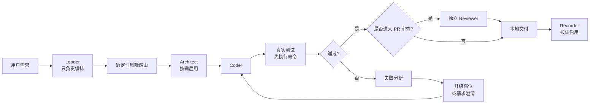

# Beggar Codex

[English](README.md)

Beggar Codex 是面向 Codex 的原生多智能体研发工作流。它根据任务风险自动选择合适的模型档位，在需要时升级推理能力和验证强度，并通过真实测试证据和独立审查完成质量收口。

开源版采用“平台无关核心 + 可选交付适配器”的设计，不依赖腾讯内部服务、Gongfeng、Knot 或内部 MCP 客户端，默认以 GitHub 作为交付平台。

## 为什么需要 Beggar

单个强模型可能会对一行配置修改和一次生产迁移使用相同的推理预算；固定的多智能体流水线则会在简单任务上执行过多阶段。Beggar 采用风险驱动的折中方案：

1. 创建子智能体前先判断任务风险。
2. 清晰、低风险任务使用低成本模型。
3. 常规跨文件开发使用平衡档位。
4. 安全、并发、不可逆变更或连续失败时升级到高保障档位。
5. 优先执行确定性命令，再让模型分析失败原因。
6. 在 Pull Request 交付边界执行审查，不强制每个小任务都走完整审查链路。

## 整体架构


```mermaid
flowchart LR
    U[用户需求] --> L[Leader\n只负责编排]
    L --> R[确定性风险路由]
    R --> A[Architect\n按需启用]
    A --> C[Coder]
    C --> T[真实测试\n先执行命令]
    T --> D{通过?}
    D -- 是 --> Q{是否进入 PR 审查?}
    D -- 否 --> F[失败分析]
    F --> E[升级档位\n或请求澄清]
    E --> C
    Q -- 是 --> V[独立 Reviewer]
    Q -- 否 --> X[本地交付]
    V --> X
    X --> N[Recorder\n按需启用]
```

Leader 负责编排、维护状态、分派子智能体和验收结果。Leader 不得假扮 Coder、Tester、Reviewer 或 Director，也不得直接修改业务代码。

## 三档风险模型

模型 ID 属于部署配置，可以替换，不应改变 workflow 策略。

| 档位 | 示例模型别名 | 典型任务 | 行为 |
|---|---|---|---|
| **L1 · Luna** | `gpt-5.6-luna` | 单文件、已有模式、验收标准清晰 | 跳过不必要的设计环节，执行最小真实验证 |
| **L2 · Terra** | `gpt-5.6-terra` | 常规功能、API 修改、跨文件重构 | 增加架构规划和更强推理，基于证据升级 |
| **L3 · Sol** | `gpt-5.6-sol` | 安全、并发、生产事故、不可逆迁移、审查争议 | 高强度推理、强制验证，必要时由 Director 终裁 |

路由依据是任务信号，而不是角色名称：风险标签、预计文件数量、需求歧义、方案新颖度、测试不确定性、不可逆性、审查争议和失败轮次都会影响路由。

```text
L1 失败或证据不足             -> L2
L2 失败、硬风险或审查争议     -> L3
连续失败或重大分歧            -> Director 根因分析
```

## 质量门禁

- **Architect**：产出 proposal、design、tasks、test plan 和明确文件范围。
- **Coder**：只修改分派文件，读取对应语言规范，补充或更新测试，并进行范围自检。
- **Tester**：执行项目真实构建和测试命令，报告完整命令、退出码和输出证据；仅在风险、失败或测试复杂度足够高时启用。
- **Reviewer**：独立读取实现，检查规格、安全、错误处理、性能、可维护性、测试有效性和简化程度。
- **Recorder**：沉淀非显而易见的决策和可复用经验。
- **Director**：处理连续失败、设计争议或能力/环境边界，不重写业务代码。

流程使用 `start-state.json` 和 `agent_dispatch.log` 记录进度，避免上下文压缩后重复执行已完成阶段。

## 成本与效率原理

1. **模型分档**：昂贵推理只用于高风险或失败任务。
2. **阶段按需启用**：普通任务先执行真实命令，只有验证价值足够高时才启动 Tester 或完整 Reviewer。
3. **任务边界清晰**：拆成可独立验收的小任务，限制重试范围。
4. **安全并行**：独立任务可以并行；共享接口、迁移、审查和 merge 保持串行。
5. **状态恢复**：已经完成的阶段不会因为上下文压缩而重复消耗 token。

Beggar 不宣称一个适用于所有用户的固定节省百分比。实际成本取决于模型价格、任务构成、上下文长度、重试率和 PR 审查策略，应在自己的环境中统计 token 和墙钟时间。

## 包含的 Skill

| Skill | 用途 |
|---|---|
| `beggar-init` | 检查 Codex workflow、可选工具、子智能体能力和 GitHub CLI/集成 |
| `beggar-brainstorming` | 在需求存在实质歧义时进行一次澄清 |
| `beggar-workflow` | 风险路由、状态管理、角色 Contract、质量门禁和升级 |
| `github-workflow` | 可选的 GitHub 仓库、Pull Request、Review、Checks 和合并适配器 |

## GitHub 集成

核心 workflow 不假设某个特定 GitHub API 实现。适配器优先使用当前 Codex 环境中已授权的 GitHub integration 或 MCP，否则使用标准 `gh` CLI：

```bash
gh auth login
gh auth status
gh pr list --state open
```

适配器会复用同一 source branch 的已有 PR，检查真实 diff 和 CI 状态，发布结构化 Review findings，并要求用户明确授权后才合并。

GitHub 认证失败只阻断平台操作，不影响本地代码读取、测试和验证报告。

## 安装

```bash
git clone https://github.com/<owner>/beggar-codex.git
cd beggar-codex
codex plugin marketplace add .
codex plugin add beggar-codex@beggar-codex
```

安装后建议新建 Codex task，并执行 `/beggar:init`。

## 可选依赖

- `openspec`：可用时使用 OpenSpec schema；不可用时使用同一变更结构的 Markdown 产物。
- `codegraph`：推荐用于跨文件调用链和影响面分析；简单任务可以直接搜索文件。
- `gh` 或 GitHub integration：只有执行 GitHub Pull Request 操作时才需要。

核心路由和质量门禁不依赖这些可选能力。

## 范围与限制

- Beggar 是工作流策略和参考实现，不保证生成代码一定正确。
- 模型 ID、价格、可用性和 reasoning 限制取决于部署环境，应在本地配置。
- 真实测试是必须的证据，模型自信不能替代测试结果。
- 当前流程不依赖人格或自定义子智能体显示名，因为这些能力无法跨 Codex runtime 稳定移植。
- GitHub 操作隔离在 `github-workflow` 中，核心流程不包含平台凭证和 provider-specific endpoint。

## 许可证与贡献

当前 staging 副本尚未声明公共许可证。发布到 GitHub 前，需要增加经过确认的许可证、贡献指南、安全策略和维护者信息。
